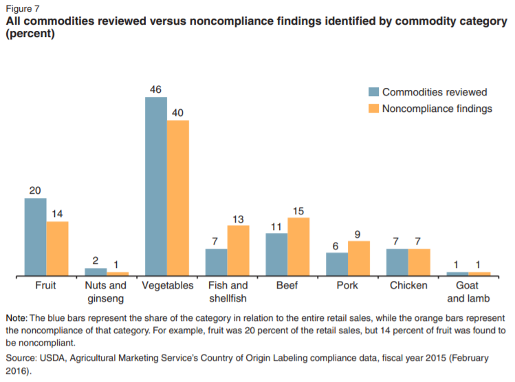
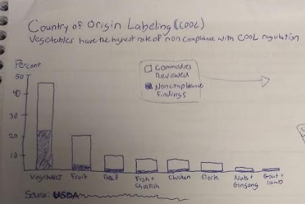
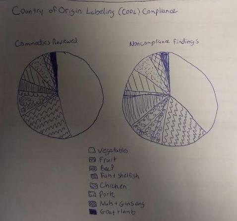
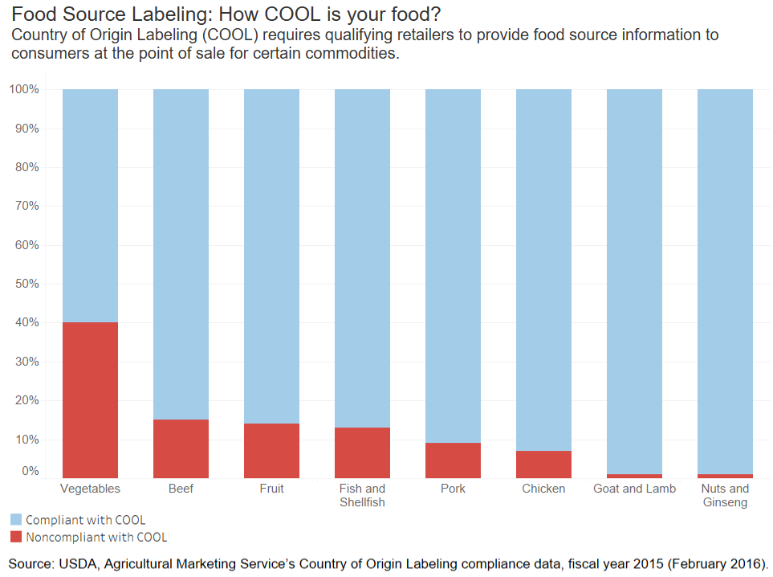

## Critique by Design
### Country of Origin Labeling (COOL)

Original data vis and why I selected  

  

Process, insights from critique - what it led me to think about in redesign, wireframes  

  

insights from user feedback, what I changed, what your redesigned data visualization shows, 
why you selected the data visualization you did, and what you attempted to show or do differently  

  

Source: Kuchler, Fred, Catherine Greene, Maria Bowman, Kandice K. Marshall, John Bovay, and Lori Lynch. *Beyond Nutrition and Organic Labels—30 Years of Experience With Intervening in Food Labels*, ERR-239, U.S. Department of Agriculture, Economic Research Service, November 2017.
