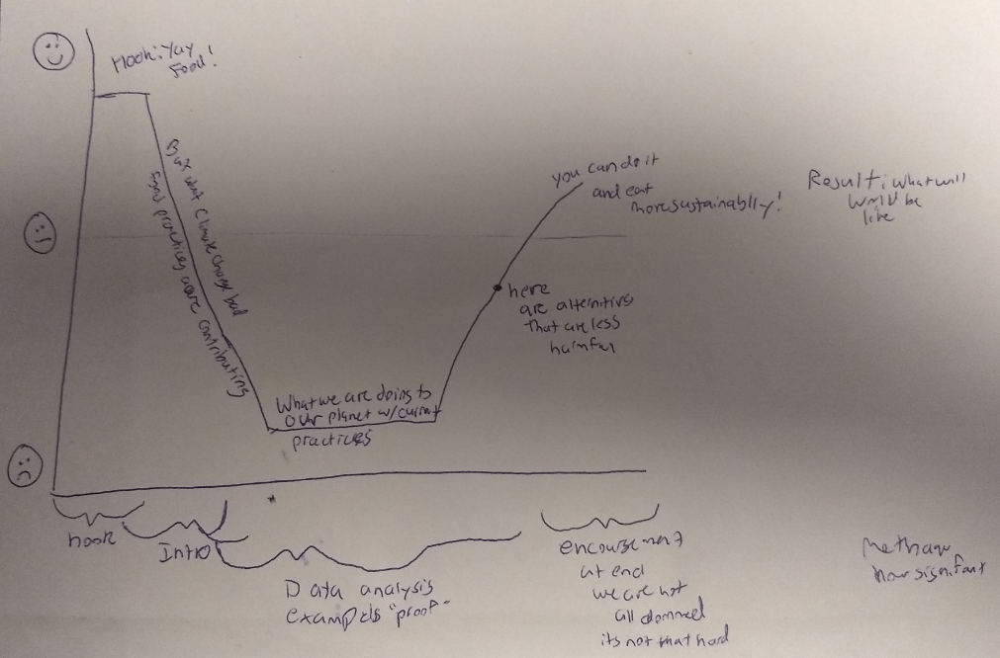
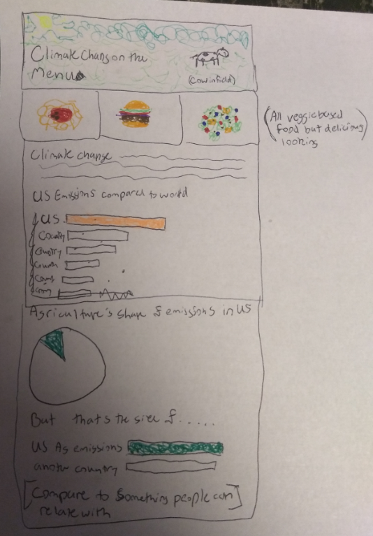
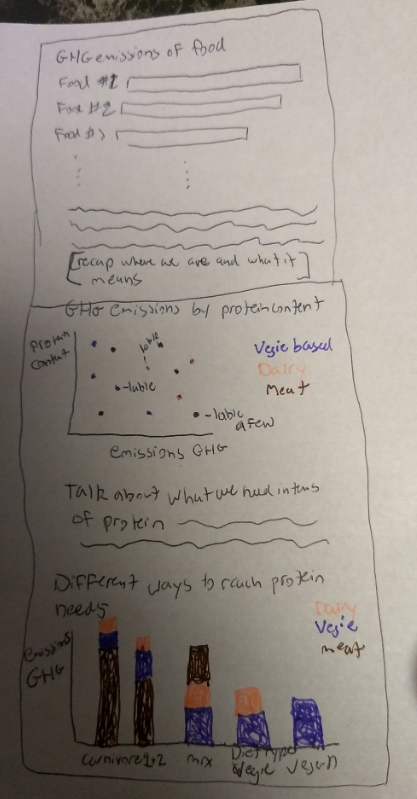
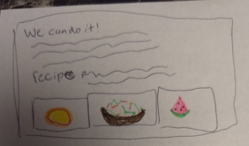

## Final Project  

### Climate Change on the Menu  

#### Outline  
For my final project, I want to show the environmental impact of our diets particularly the environmental impact of meat consumption. I will be using greenhouse gas (GHG) emissions to quantify the environmental impact.  

My audience will be Americans who have an interest in their environmental footprint as I will be looking at greenhouse gas emissions within the United States. In the end, I want my readers to leave thinking, as a consumer, I want a sustainable diet so that I can decrease my environmental footprint.  

I will hook my audience with pictures or descriptions of food – something we all can identify with and are drawn to. To set up my story, I will talk about some of the effects of climate change and how they impact us personally. I will also show how agriculture practices and our food consumption are contributing.  

The conflict will involve the differing greenhouse gas footprints of common food items. This will show how the audience’s food choices directly impact the health of the planet and climate change. I will also show the protein of these food sources so that protein content can be compared to emissions. I expect some viewers to feel conflicted over having a nice steak dinner and helping the environment. However, my motivation is not to shame people, but motivate them to action.   

The resolution will present how reducing meat consumption and thinking in a plant forward way can reduce someone’s environmental footprint. I will show alternatives to a meat-centric diet that are still tasty and filling. My call to action will encourage viewers to begin to limit their consumption of high-impact meats, reduce their overall consumption of meat, and to reimagine meals in a plant-centric way.  

#### Sketches  
Overall emotional journey of my story arc:  
  
Story line:  
  

  

#### Data  
I will be using four data sets for my project.  

1. GHG emissions by country will come from the United Nations Framework Convention on Climate Change found on UN Data.  Data from this site will allow me to compare the United States’ GHG emissions to that of other countries. I will also use this data to compare the United States’ agricultural GHG emissions to the emissions of another country.  
[UN Greenhouse Gas Emissions by Country](http://data.un.org/Data.aspx?d=GHG&f=seriesID%3aGHG)  

2. The United States Environmental Protection Agency (EPA) details the portion of the U.S.’s emissions that come from the agriculture sector. I plan on using this information bring the viewer on a journey from climate change overall to the environmental impact of the agriculture sector within the U.S.  
[EPA Emissions by Source]( https://www.epa.gov/ghgemissions/sources-greenhouse-gas-emissions#agriculture)  

3. The GHG emissions of different types of food was published by Poore and Nemecek in the journal *Science*. I accessed the article from CMU’s Library. I will be using the mean emissions of each food type that Poore and Nemecek identified for this project.  
[GHG Emissions of Food](https://science-sciencemag-org.proxy.library.cmu.edu/content/360/6392/987/tab-figures-data)  

4. To compare the GHG emissions of food to their protein content, I will be using John Hopkins Medicine’s protein content of food data source.  
[John Hopkins Protein Content of Food](https://www.hopkinsmedicine.org/johns_hopkins_bayview/_docs/medical_services/bariatrics/nutrition_protein_content_common_foods.pdf)  

**Sources**  

Johns Hopkins Medicine. (2019, June). PROTEIN CONTENT OF COMMON FOODS. Retrieved from https://www.hopkinsmedicine.org/johns_hopkins_bayview/_docs/medical_services/bariatrics/nutrition_protein_content_common_foods.pdf  
Poore, J., & Nemecek, T. (2018). Reducing food’s environmental impacts through producers and consumers. Science, 360(6392), 987–992. https://doi.org/10.1126/science.aaq0216  
United Nations Framework Convention on Climate Change. (2019, January 6). Greenhouse Gas (GHGs) Emissions without Land Use, Land-Use Change and Forestry (LULUCF), in kilotonne CO2 equivalent. In UN Data. Retrieved from http://data.un.org/Data.aspx?d=GHG&f=seriesID%3aGHG  
United States Environmental Protection Agency. (n.d.). Sources of Greenhouse Gas Emissions. In Greenhouse Gas Emissions. Retrieved from https://www.epa.gov/ghgemissions/sources-greenhouse-gas-emissions#agriculture  

#### Method and Medium  
I plan on using Shorthand to complete and display my final project. I have accepted the invitation that was sent and created my account.  

I will export my data values in to an excel spreadsheet and use Tableau and/or Datawrapper to create my visualizations. I will consult CMU’s Library resource on using images properly for the images of food that I plan on using.  

In my final presentation, I will tell a shortened version of my story verbally while pausing on different spots in my Shorthand page to show the visualizations. 

