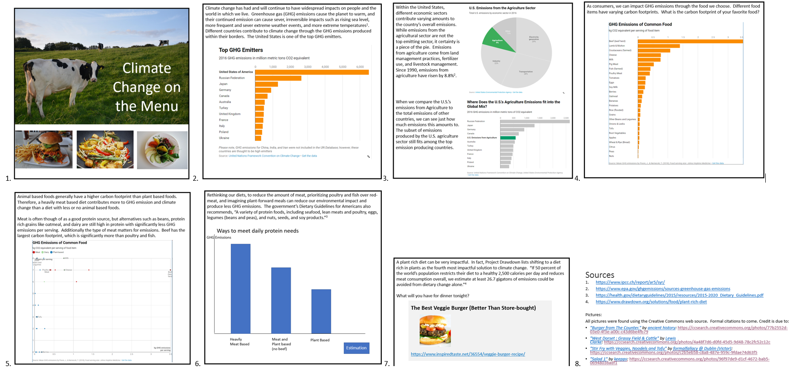
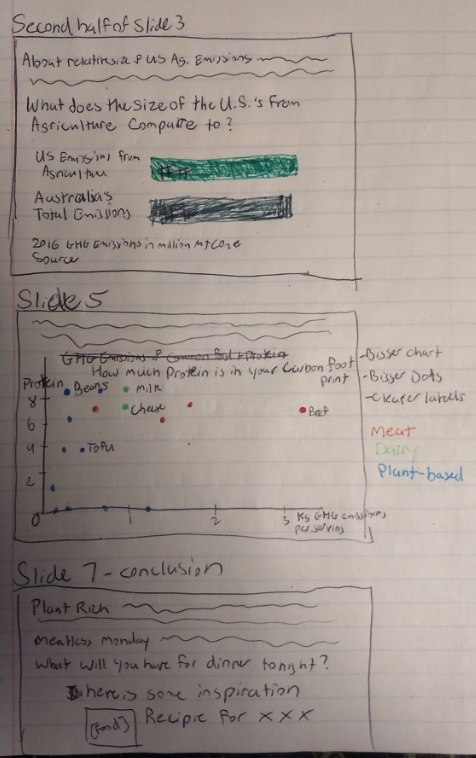

## Final Project - Part II

### Climate Change on the Menu  

#### User Research Protocol
During this feedback process, I hope to identify ways in which to improve my story. I am interested to hear how my users might perceive my story and the message they take from the data visualizations and narrative. I will pay close attention for any places where I might have confused the user or inadvertently mislead them.  
The target audience I hope to reach with my story are people who know a little bit about climate change but do not know how they are personally contributing or positive reduction actions that they can take. My audience will have heard about some of the doom and gloom of climate change professed through news articles but will not have conducted research on their own nor will they have been formally taught about the subject.  
I will rely on my past interactions with family, friends, and colleagues to pick individuals who fit my target audience to interview. Since I work in the environmental field, I tend to surround myself with people who have a basic understanding of climate change. I have discussed climate change with most people at some level, and I find that my family, friends, and colleagues will often excitedly tell me about an article that they just read about the environment.  
#### Wireframes
Below is a picture of the wireframes I created for part two of this project which expanded upon my initial sketches. I used the data sources I identified in [Part 1 of this project](https://sarahswa.github.io/swartz_portfolio/climatechangeandfood) to create the charts. I used Datawrapper to turn my raw data into charts for all of these visualizations.  

#### Interview Script
Hi – I’m working on a story for one of my classes, and I would love to get some feedback.  Would you be willing to spend 10 minutes providing some anonymous feedback?

Great!  Throughout this process there are no wrong answers, I am simply looking for how people might perceive these frames as a website.

Please take some time to review the wireframes here.  (For questions 1 and 2, stop people after a slide or two and ask; ask remaining questions at end).

1.	Can you tell me what you think this site is?

2.	Can you describe what this is telling you?

3.	Was there anything you find surprising or confusing?

4.	Is there any pace where you would like more information?

5.	Is there anything you would change or do differently?

6.	After reading this, do you plan to make any changes to your diet?

7.	Do you have any questions about this story or about this process?

Thank you for your time!  If you would like a link to my final project, I would be happy to provide it to you after completion.

#### Interview Findings
I interviewed four people who fell within my target audience for this feedback process. Three of the four were women, and three of the four (one male and two females) were from the millennial generation.  

Overall, all individuals were able to follow along with my story line and understood the message I was trying to convey. Three of the four were very supportive of the push for a more plant forward diet, and everyone pointed out the high carbon footprint that beef had. A few users even caught a couple spelling and grammar mistakes I made – its always great to get a second set of eyes on something.  

Two of the individuals misinterpreted my *Where Does the U.S.’s Agriculture Emissions fit into the Global Mix* chart. In this chart I had compared the U.S.’s emissions from agriculture to entire country emissions. I could see how I was misleading in this chart as these individuals thought these were the emissions from agriculture for all countries.  

Two users had a hard time interpreting what I think is my weakest chart: the scatter plot *GHG Emissions of Common Food*. I had a hard time customizing this chart in Datawrapper, so I will remake this chart in Tableau. 

I received mixed reviews about my use of pictures in the beginning.  I am interested to see how this will look on Shorthand to see if I need to make any changes. I will also make my suggestion of a recipe more obvious at the end of my presentation, as one individual did not understand this part. 

I received some great suggestions for improvement as well. One of the individuals suggested breaking up the amount of information shown in the third wireframe, and, on my final website, I will plan to have less information appear on the screen at one time. One individual suggested that I build out more options of ways people can cut back on meat into my narrative at the end of the story i.e. meatless Mondays. One individual suggested transforming my *Ways to meet daily protein needs* chart into a stacked bar chart with colors that represent a veggie, meat, or dairy protein source. This was my eventual goal for this chart, so it was great to hear that that is what he expected. 

#### Changes to Wireframes

#### Next Steps
•	Re-create the *GHG Emissions of Common Food* scatter chart in Tableau
•	Bring my re-created sketch which compares the U.S.’s agriculture emissions to another country to life
•	Create the *Ways to meet daily protein needs* in Datawrapper
•	Edit and, in some places, build out my narrative
•	Understand how to build content on Shorthand
•	Formally cite all sources with APA format rather than simply listing the website
