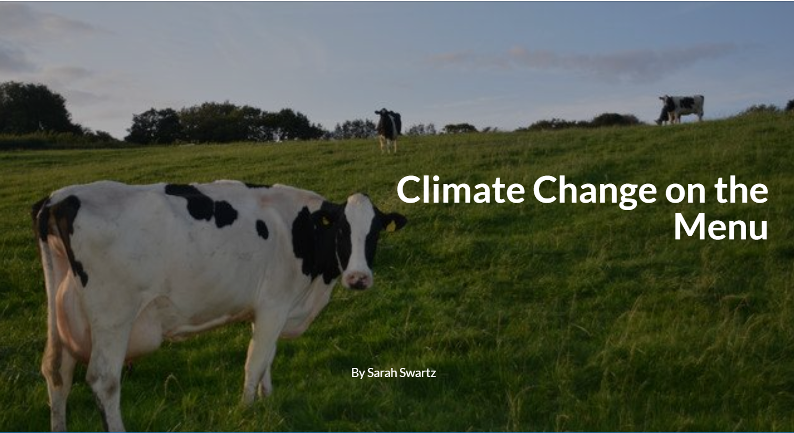
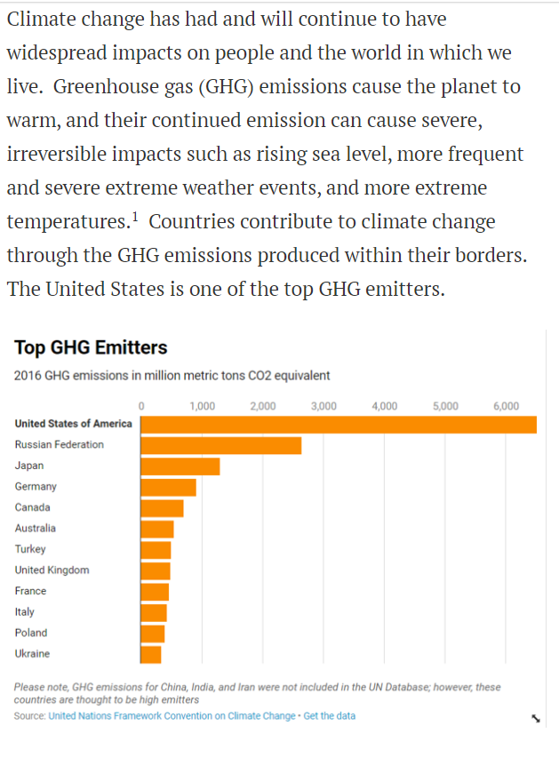
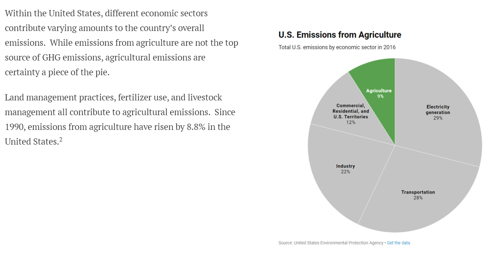
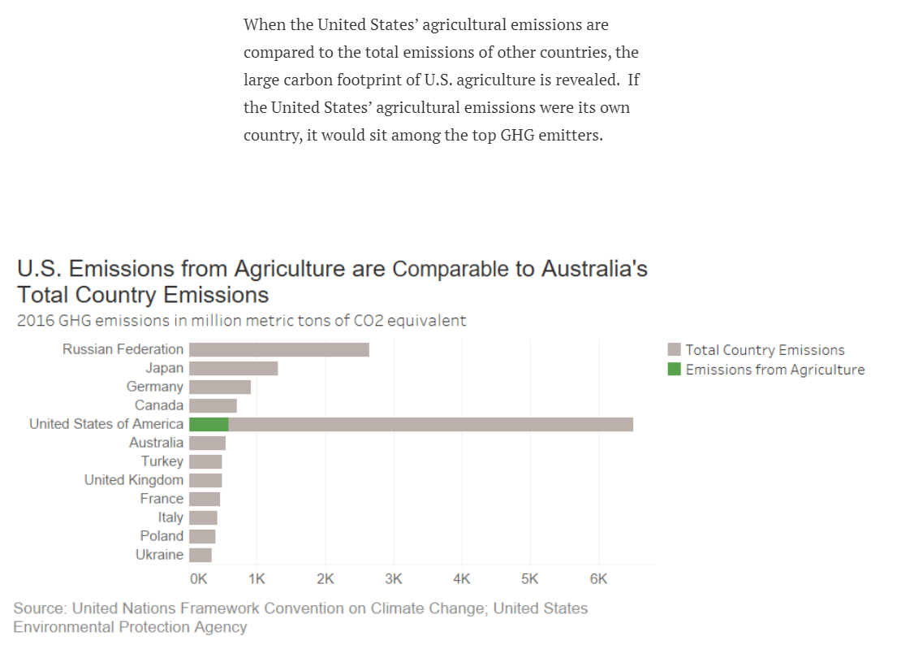
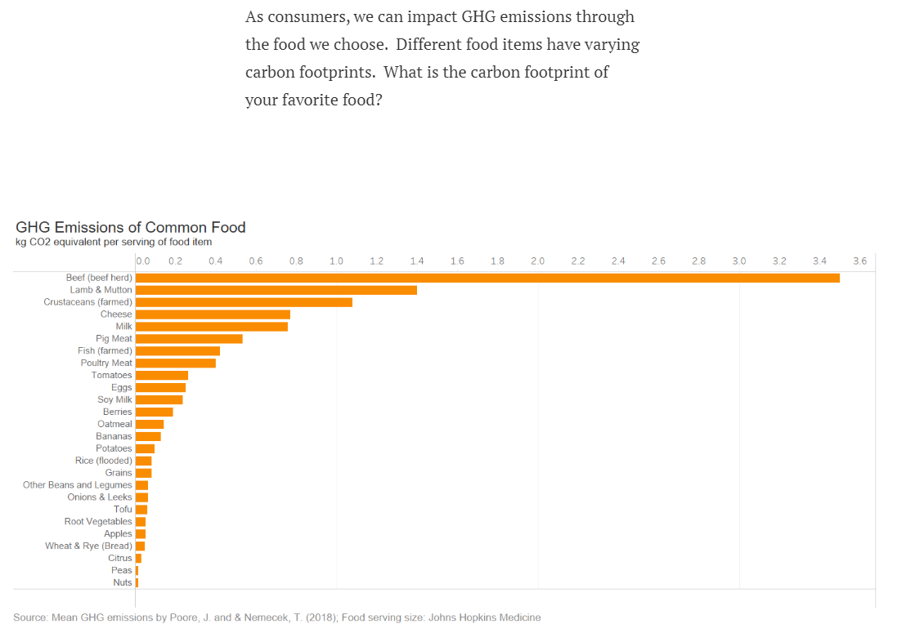
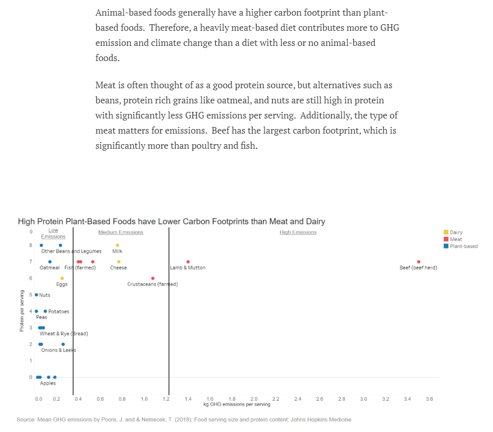
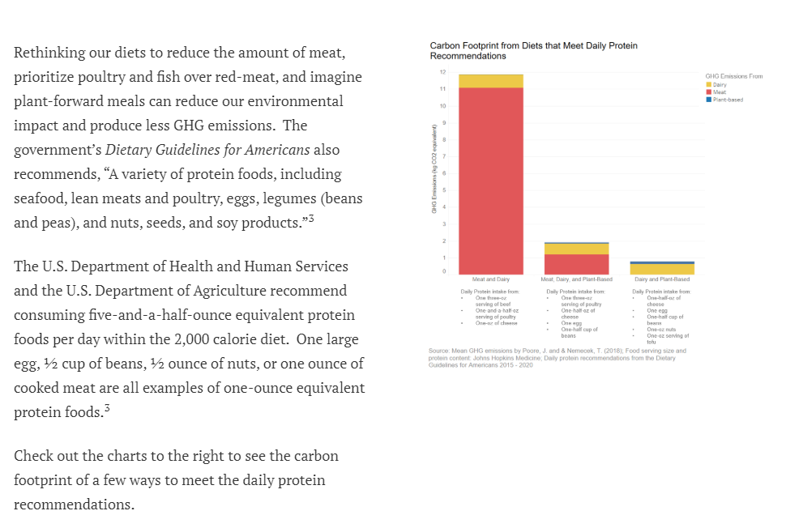
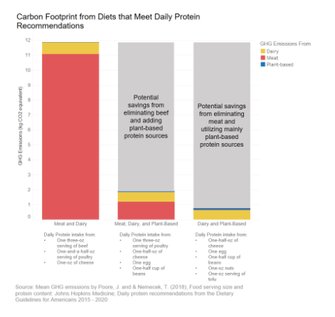
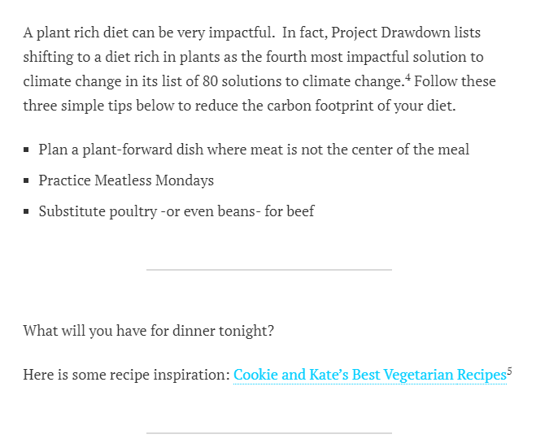

## Final Project - Part III

### Climate Change on the Menu  

#### Overview  
This page serves as a behind the scenes glimpse into the last stage of my final project. To see the journey from the beginning please us the following links:  
[Part I – The Idea](https://sarahswa.github.io/swartz_portfolio/climatechangeandfood)  
* Project outline
* High-level summary
* Structure with major elements outlined
* Data sources and planned use
* Links to publicly-accessible data
* Approach   
[Part II – Design and User Research](https://sarahswa.github.io/swartz_portfolio/finalpart2)  
* Sketches and storyboards
* User research and findings
* Wireframes  

If you are like me and like to read the last page of a book before the end to know what happens, you may access the final story below. However, read on to see the final evolution!  
[Climate Change on the Menu]( https://carnegiemellon.shorthandstories.com/climate-change-on-the-menu/index.html)  

#### Final Data Story  
The intended audience for my story is people who know a little bit about climate change but do not know how they are personally contributing. These individuals are aware of some “green” efforts such as reusable shopping bags but are not aware of food’s connection to climate change. My audience is United States based and are either Millennials or Generation X. With my story, I want to engage people who are interested in reducing their environmental impact but don’t know where to start; and, I want to convince the meat eater who makes fun of vegans to try a Meatless Monday or consider a chicken sandwich instead of a burger next time he is at the grill.  

This story was completed to showcase the data visualization and story telling concepts I learned in class. The end result utilizes my new knowledge of color concepts, different chart types, new data visualization tools/software, and the importance of user feedback.  

My story started out as an idea to show the carbon footprint of food. From there, I researched different data sources that could be used to tell this story – greenhouse gas emissions of countries, economic sectors, and food; protein content of food; and dietary guidelines. Armed with this data I framed out my story’s message, funneling the audience from a broad picture view of climate change to their own dietary impact. Next, I created wireframes which provided a rough view of my story’s charts and message. The user feedback from people who fit my target audience and my classmates was extremely helpful. I used their feedback and reactions to amend the areas of my story that were confusing, unintentionally misleading, or left more to be desired (see the link to Part II for more detail). I used Datawrapper and Tableau to create my visualizations, then built my story in Shorthand. I closed my story with a call to action which encouraged people to reduce the amount of meat in their diets, and I provided a few simple tips and a resource of recipes to get them started.  

Please find my story here: [Climate Change on the Menu]( https://carnegiemellon.shorthandstories.com/climate-change-on-the-menu/index.html)  
Because I know my story will not stay live on Shorthand forever, but, alas, the internet lives forever, below are screenshots from the final display.  
  
  

#### Sources  
*Data*  
Johns Hopkins Medicine. (2019, June). PROTEIN CONTENT OF COMMON FOODS. Retrieved from https://www.hopkinsmedicine.org/johns_hopkins_bayview/_docs/medical_services/bariatrics/nutrition_protein_content_common_foods.pdf  
Poore, J., & Nemecek, T. (2018). Reducing food’s environmental impacts through producers and consumers. Science, 360(6392), 987–992. https://doi.org/10.1126/science.aaq0216  
United Nations Framework Convention on Climate Change. (2019, January 6). Greenhouse Gas (GHGs) Emissions without Land Use, Land-Use Change and Forestry (LULUCF), in kilotonne CO2 equivalent. In UN Data. Retrieved from http://data.un.org/Data.aspx?d=GHG&f=seriesID%3aGHG  
United States Environmental Protection Agency. (n.d.). Sources of Greenhouse Gas Emissions. In Greenhouse Gas Emissions. Retrieved from https://www.epa.gov/ghgemissions/sources-greenhouse-gas-emissions#agriculture  

*Research*  
1. IPCC, 2014: Climate Change 2014: Synthesis Report. Contribution of Working Groups I, II and III to the Fifth Assessment Report of the Intergovernmental Panel on Climate Change [Core Writing Team, R.K. Pachauri and L.A. Meyer (eds.)]. IPCC, Geneva, Switzerland, 151 pp.  
2. United States Environmental Protection Agency. (n.d.). Sources of Greenhouse Gas Emissions. In Greenhouse Gas Emissions. Retrieved from https://www.epa.gov/ghgemissions/sources-greenhouse-gas-emissions#agriculture  
3. U.S. Department of Health and Human Services and the U.S. Department of Agriculture. (2015, December). Dietary Guidelines for Americans 2015 - 2020, Eighth Edition, xiii, 19. https://health.gov/dietaryguidelines/2015/resources/2015-2020_Dietary_Guidelines.pdf  
4. Project Drawdown. (2014-2019). Food Plant Rich Diet. In Project Drawdown. Retrieved from https://www.drawdown.org/solutions/food/plant-rich-diet  
5. Cookie and Kate. (2019). 29 Best Vegetarian Recipes. In Cookie and Kate. Retrieved from https://cookieandkate.com/29-best-vegetarian-recipes/  

*Pictures*
"West Dorset : Grassy Field & Cattle" by Lewis Clarke, licensed under CC BY-SA 2.0 : https://www.geograph.org.uk/photo/5509016  
"Burger from The Counter." by ancient history, licensed under CC BY-NC 2.0: https://www.flickr.com/photos/7745843@N03/4908963649  
"Stir Fry with Veggies, Noodels and Tofu" by formalfallacy @ Dublin (Victor), licensed under CC BY-NC-SA 2.0: https://www.flickr.com/photos/10856846@N07/7177160577  
"Salad 1" by keepps, licensed under CC BY-NC-SA 2.0: https://www.flickr.com/photos/93799798@N00/53990186  
"Hearty Paleo Vegetable Soup" by paleogrubs, licensed under CC BY 2.0: https://www.flickr.com/photos/141771825@N06/27118735403  
"1875" by miikkahoo, licensed under CC BY-SA 2.0: https://www.flickr.com/photos/25016563@N00/2653619208  
"beet, greens and goat cheese linguine_main" by Jackie Newgent RDN, CDN, licensed under CC BY-NC-SA 2.0: https://www.flickr.com/photos/73343592@N08/20591232539  

